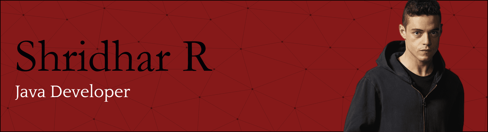

# Shridhar R  

---

## 👨‍💻 About Me  
Senior-year AI & ML undergraduate, proficient in Java, MySQL, C, Linux, and Power BI, with a good understanding of computer networks, OOP, and core CS concepts. Focused on applying technical skills to real-world solutions and open to opportunities.  

---

## 🟦 Tech Stack  

<!-- Added animated tech stack with hover effects and left alignment -->

  
  
  
  
  
  
  
  

---

## 📊 GitHub Stats

<!-- Changed alignment from center to left for all stats sections -->

  
### 📈 Overall Statistics

### 🔥 Streak Stats  

### 💻 Most Used Languages

---

## 🏆 Competitive Programming  

<!-- Changed alignment from center to left -->

  

Check out my problem-solving journey on [LeetCode](https://leetcode.com/u/sh8fx/)  

---

## 🤝 Let's Connect  

<!-- Changed alignment from center to left -->

  
  

